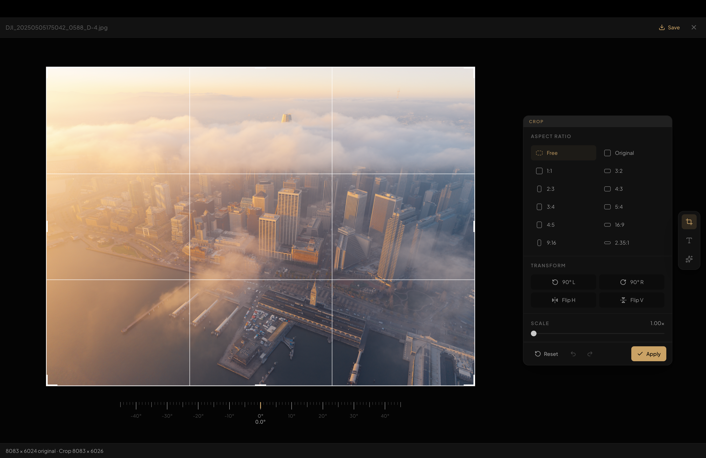
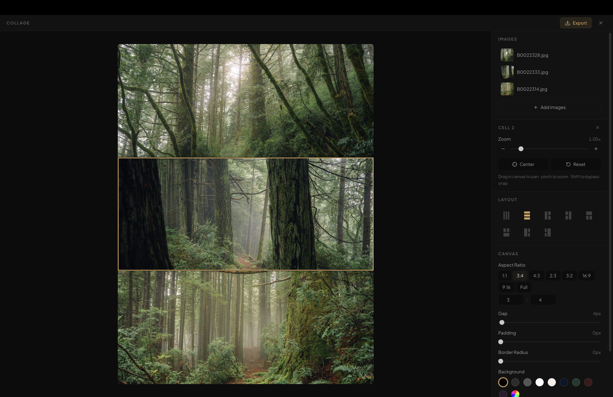
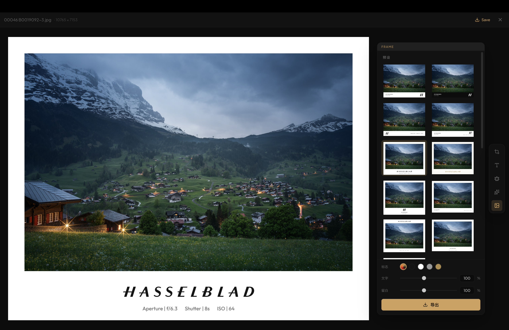
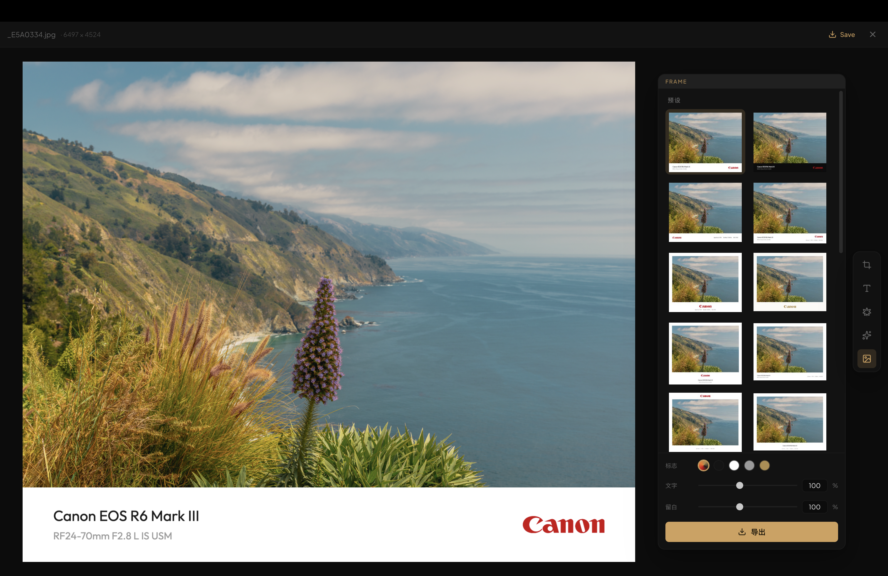
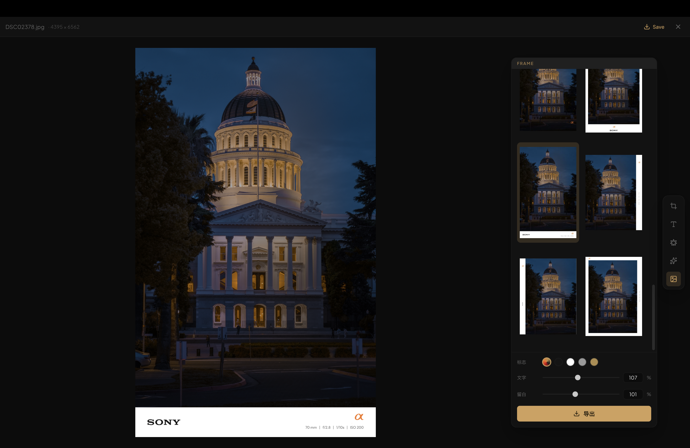
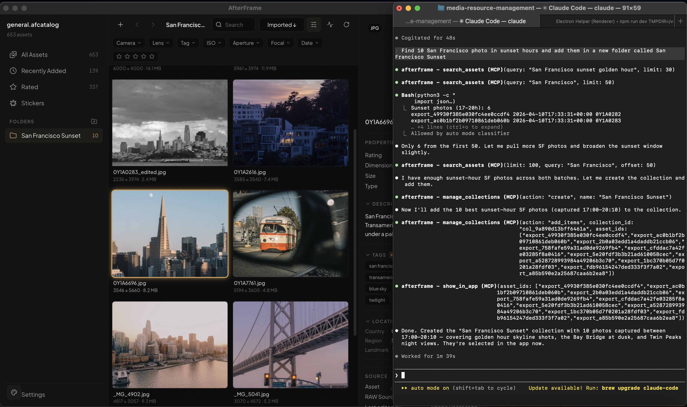
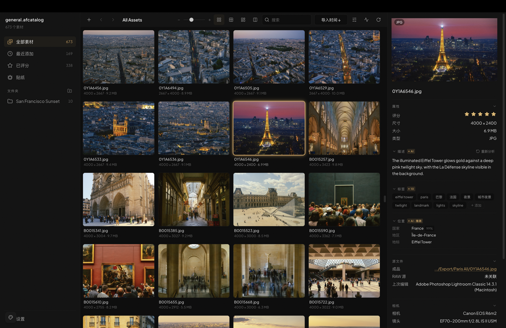

<p align="center">
  
</p>

# AfterFrame

**English** | [简体中文](README.zh-CN.md)

A local-first photo workspace for browsing, editing, and managing large photography libraries.

AfterFrame is built for photographers who work with thousands of exported images and want a fast, visual tool to browse, organize, crop, add text overlays, and experiment with AI-powered style transfer — all without leaving one app.

## Download

Download the latest `.dmg` from [Releases](../../releases).

> macOS only (Apple Silicon). Signed with an Apple Developer ID. If a build isn't notarized yet, macOS may warn on first launch — right-click the app and choose **Open**, or allow it under System Settings → Privacy & Security.


## Table of Contents

- [Features](#features)
  - [Library Management](#library-management)
  - [Browse & Organize](#browse--organize)
  - [Search & Filter](#search--filter)
  - [Edit](#edit)
  - [Video](#video)
  - [AI Repaint (BYOK)](#ai-repaint-byok)
  - [AI Auto-Annotation (BYOK)](#ai-auto-annotation-byok)
  - [Agent-Native (MCP)](#agent-native-mcp)
- [Getting Started](#getting-started)
- [Project Structure](#project-structure)
- [Customization](#customization)
- [Built With](#built-with)

## Features

### Library Management
The core of AfterFrame — a catalog-based workflow that keeps your originals on disk and everything else indexed and fast.

- Catalog-based workflow — one `.afcatalog` per project
- Import pipeline with automatic metadata extraction and preview generation
- Two preview tiers: fast 512px thumbnails always, plus optional 2000px HD previews (toggle in Settings → Library, off by default to save disk)
- Optional RAW source indexing and matching by filename
- HEIC / HEIF support — originals are transcoded to JPEG on demand so iPhone photos display everywhere (lightbox, editor, collage) at full resolution
- Unified background-activity dock: imports, previews, annotation, and AI jobs all report progress in one place and can be cancelled
- Bilingual interface (English / 简体中文) — switch live in Settings → General
- Local-first: your files stay on your drives, nothing is uploaded


### Browse & Organize
- Grid, tiles, justified, and waterfall layout modes
- Sort by imported time, captured time, rating, or name
- Smart collections and manual folders
- Full metadata inspector: EXIF, camera, lens, exposure, dates
- Star rating system (imports Lightroom XMP ratings)
- Virtual-scroll gallery that handles 10,000+ images smoothly


### Search & Filter
- Full-text search across filename, camera/lens, and AI annotations (caption, detected text/OCR, tags) — find photos by what's actually in them
- Faceted filter bar: camera and lens, ISO / aperture / focal-length ranges, capture-date range, and star rating — combined live
- Tag filtering: click any tag in the inspector, or pick from a searchable tag list (server-side search, scales to thousands of tags)

### Edit
- **Crop** with preset aspect ratios, rotation, and flip



- **Text Overlay** with system fonts, solid/gradient fill, stroke, shadow, background, opacity, and snap-to-center guides


- **Depth-aware Text** — on-device CoreML depth inference (Depth Anything V2) lets text sit behind subjects in the scene, iPhone-wallpaper style. Bring your own model via the model picker; preference is persisted


- **Stickers** — extract subjects from any photo with one click (VisionKit on macOS 14+), save to a per-catalog library with optional outline and shadow, then drop them as image layers on any other photo. Stickers share the same depth, opacity, and rotation controls as text layers


- **Collage** maker with 8 layout templates, adjustable gap/padding/border-radius, background color, and high-res export. Per-cell pan and zoom with snap-to-center alignment guides, precise zoom slider, and trackpad pinch sync — drag any cell to reframe, swap two cells by dropping one on the other



- **Frame** — brand-aware camera watermark frames driven by EXIF. Pick from 20+ presets (bottom bars, dual-logo, and vertical side-strip layouts), rendered with real brand logos and colors for Hasselblad, Sony, Canon, Nikon, Leica, Fujifilm, Lumix, and Ricoh, plus a clean generic set. Adaptive light/dark contrast, a logo color picker (原色 / black / white / grey / gold), text and margin scaling, and export at the original resolution







### Video
- Index video files alongside photos — each clip is probed for duration, dimensions, and codec on import, and a poster frame is generated automatically
- Gallery cards show the poster with a duration badge; hover to scrub a keyframe filmstrip without opening anything
- Full playback in the lightbox via a custom player (play/pause, scrubber, volume, fullscreen, spacebar)
- Automatic on-the-fly H.264 proxy for codecs the OS can't decode natively (e.g. 10-bit HEVC), so clips still play back

### AI Repaint (BYOK)
Bring your own API key. AfterFrame does not bundle or proxy any AI service — you connect your own provider and all requests go directly from your machine to the API.

- Supports Gemini, GPT Image, Jimeng, or any OpenAI-compatible endpoint — manage providers and per-provider model defaults in Settings → AI Repaint
- 25 built-in style prompts (oil painting, anime, watercolor, ink, concept art, and more)
- Side-by-side and stacked before/after comparison
- Version history for every repaint


### AI Auto-Annotation (BYOK)
Generate a caption, tags, and a location guess for your photos with your own LLM provider (Anthropic, OpenAI, or any OpenAI-compatible endpoint). As with AI Repaint, requests go directly from your machine to the API.

- Annotate one photo, a multi-selection, a whole folder, or every un-annotated asset — all as tracked background jobs with live progress
- Optional auto-annotate on import
- Bilingual tags (English / 中文), with configurable tag count and caption length
- Hand-edit per-photo tags — remove a wrong one or add your own (with the same tag search)
- Results power Search & Filter above; HEIC / RAW inputs handled

### Agent-Native (MCP)
AfterFrame embeds an [MCP](https://modelcontextprotocol.io) server, so any AI agent — Claude Code, Claude Desktop, or anything MCP-compatible — can drive your library in natural language while the app runs:

> "Import the photos on my Desktop" · "Find the vertical shots from last month and show them to me" · "Crop these to 4:3 for Xiaohongshu" · "Tag everything that has no tags yet" · "Export this collection at 2048px JPEG"

- **17 tools**: search (full-text + EXIF facets), thumbnails the agent can actually see, import, crop, export, tags/ratings, collections, AI annotation & repaint jobs, deletion — plus job control
- **Two-way selection bridge** — select photos in the app and say "these"; the agent's picks get highlighted and scrolled into view right in your gallery (`show_in_app`)
- **Visible & cancellable** — agent-started work appears in the same background-activity dock as your own, with live progress and a Cancel button
- **Local-only** — the server listens on `127.0.0.1:41706` while the app runs; same BYOK privacy stance as everything else

**Connect an agent** (AfterFrame must be running):

```bash
# Claude Code — one-time setup, works from any directory
claude mcp add --transport http afterframe http://127.0.0.1:41706/mcp
```

Working inside this repo? Nothing to do — the bundled `.mcp.json` connects Claude Code automatically. Other MCP clients (Claude Desktop etc.): add a remote HTTP server with the same URL.

Then just ask: *"Find my photos of California and show them in the app."*



The full interface in 简体中文 (switch live in Settings → General):



## Getting Started

### Requirements
- macOS (Apple Silicon)
- Python 3.10+ (for the sidecar service, development only)
- Node.js 18+ (development only)

### Development

```bash
# Install frontend dependencies
cd apps/desktop
npm install

# Start dev server
npm start
```

### Build

```bash
cd apps/desktop
npm run dist:mac          # rebuild sidecar, then package + sign (Developer ID)
npm run dist:mac:release  # also notarize — set APPLE_ID / APPLE_APP_SPECIFIC_PASSWORD / APPLE_TEAM_ID
```

The `.dmg` will be in `apps/desktop/release/`. Requires `pyinstaller` (`pip3 install pyinstaller`) for the sidecar step. Signing uses the Developer ID Application certificate in your keychain; `dist:mac:release` additionally uploads the build to Apple for notarization.

## Project Structure

```
apps/desktop/          Electron + React desktop app (embedded MCP server in electron/mcp/)
services/sidecar/      Python backend (SQLite catalog, metadata, AI repaint)
RESOURCES/             AI style prompt libraries, design assets
docs/                  Screenshots and developer docs
```

## Customization

### AI Style Prompts
Edit `~/Library/Application Support/afterframe/ai-styles.json` to add or modify style prompts. Changes take effect on restart.

```json
[
  { "id": "my-style", "name": "My Style", "prompt": "Transform this photo into..." }
]
```

## Built With

This project was vibe-coded with [Claude Code](https://claude.ai/code).

---

For implementation details, see [docs/developer-setup.md](docs/developer-setup.md).
