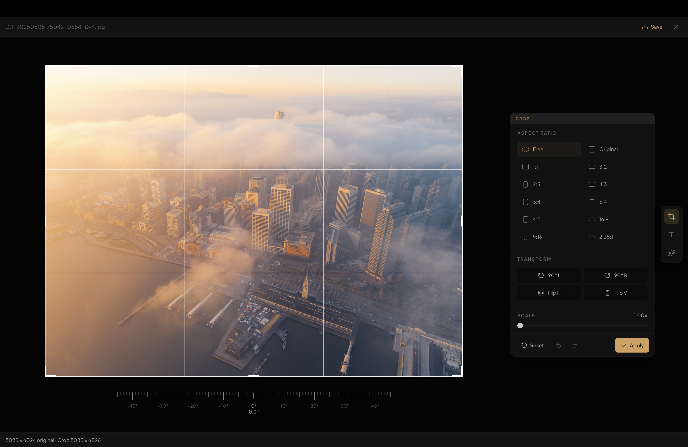
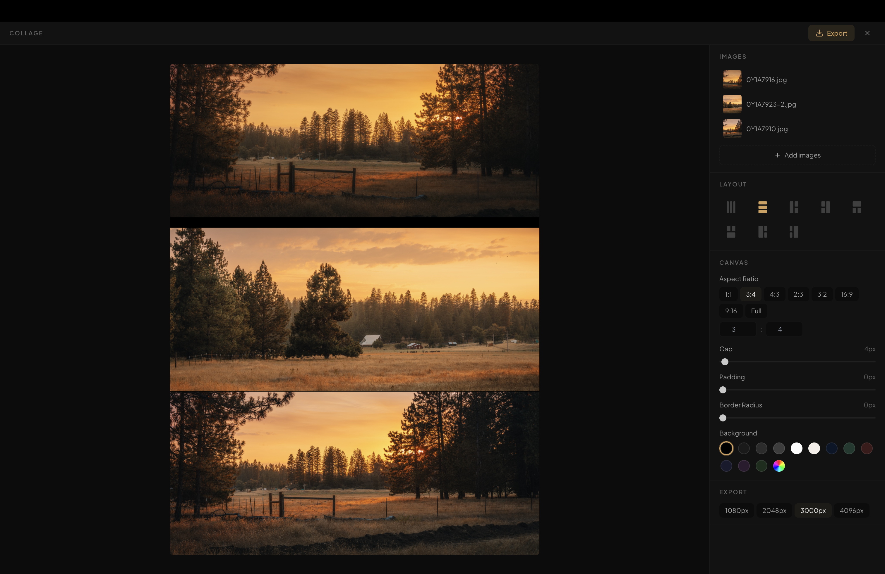

# AfterFrame

[English](README.md) | **简体中文**

一个本地优先的摄影工作台，用于浏览、编辑和管理大规模照片库。

AfterFrame 面向拥有大量导出图片的摄影师，提供快速的可视化浏览、整理、裁剪、文字叠加和 AI 风格迁移功能 — 全部在一个应用内完成。

## 下载

从 [Releases](../../releases) 下载最新 `.dmg`。

> 仅支持 macOS（Apple Silicon）。未签名 — 首次打开前，请在终端运行 `sudo xattr -rd com.apple.quarantine /Applications/AfterFrame.app`，或前往系统设置 > 隐私与安全性中允许打开。


## 功能

### 浏览与整理
- 网格、瓦片、对齐、瀑布流四种布局模式
- 按导入时间、拍摄时间、评分或文件名排序
- 智能集合和手动文件夹
- 完整元数据检查器：EXIF、相机、镜头、曝光、日期
- 星级评分（自动导入 Lightroom XMP 评分）
- 虚拟滚动画廊，流畅处理 10,000+ 张图片


### 编辑
- **裁剪**：预设比例、旋转、翻转



- **文字叠加**：系统字体、纯色/渐变填充、描边、阴影、背景、透明度、自动吸附居中线


- **深度感知文字**：本地 CoreML 深度推理（Depth Anything V2），让文字像 iPhone 锁屏壁纸一样落在主体后面。支持选择自定义模型，偏好设置自动持久化


- **贴纸**：一键从任意照片中抠出主体（macOS 14+ 使用 VisionKit），存入按 catalog 隔离的贴纸库，可选描边与阴影；再把贴纸作为图层放到其他照片上，深度、不透明度、旋转控件与文字图层共用一套


- **拼图**：8 种布局模板，可调间距/内边距/圆角，自定义背景色，支持高分辨率导出



### AI 重绘（BYOK）
自带 API Key 模式。AfterFrame 不内置也不代理任何 AI 服务 — 你自行配置 API 密钥，所有请求从你的电脑直连 API。

- 支持 Gemini、GPT Image、即梦，或任意 OpenAI 兼容端点
- 25 个内置风格提示词（油画、动漫、水彩、水墨、概念艺术等）
- 并排和上下对比的前后效果预览
- 每次重绘的版本历史记录


### 素材库管理
- 基于 Catalog 的工作流 — 每个项目一个 `.afcatalog`
- 导入流水线：自动提取元数据与生成预览
- 可选的 RAW 源文件索引与按文件名匹配
- 本地优先：文件始终保留在你的硬盘上，不会上传


## 快速开始

### 环境要求
- macOS（Apple Silicon）
- Python 3.10+（sidecar 服务，仅开发需要）
- Node.js 18+（仅开发需要）

### 开发环境

```bash
# 安装前端依赖
cd apps/desktop
npm install

# 启动开发服务器
npm start
```

### 构建

```bash
# 构建 sidecar 二进制
cd services/sidecar
pyinstaller media-workspace.spec --distpath dist --noconfirm

# 打包桌面应用
cd apps/desktop
npm run dist:mac
```

`.dmg` 文件位于 `apps/desktop/release/`。

## 项目结构

```
apps/desktop/          Electron + React 桌面应用
services/sidecar/      Python 后端（SQLite catalog、元数据、AI 重绘）
RESOURCES/             AI 风格提示词库、设计资源
docs/                  截图与开发文档
```

## 自定义

### AI 风格提示词
编辑 `~/Library/Application Support/afterframe/ai-styles.json` 即可添加或修改风格提示词，重启后生效。

```json
[
  { "id": "my-style", "name": "我的风格", "prompt": "将这张照片转换为..." }
]
```

## 构建方式

本项目通过 [Claude Code](https://claude.ai/code) vibe coding 完成。

---

实现细节请参阅 [docs/developer-setup.md](docs/developer-setup.md)。
